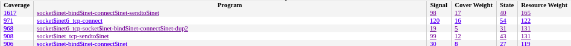
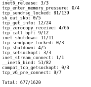
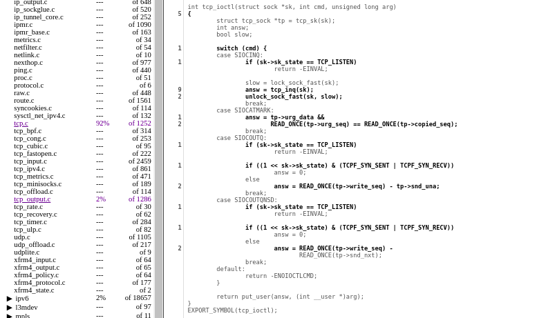
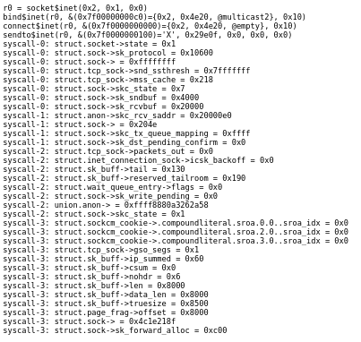
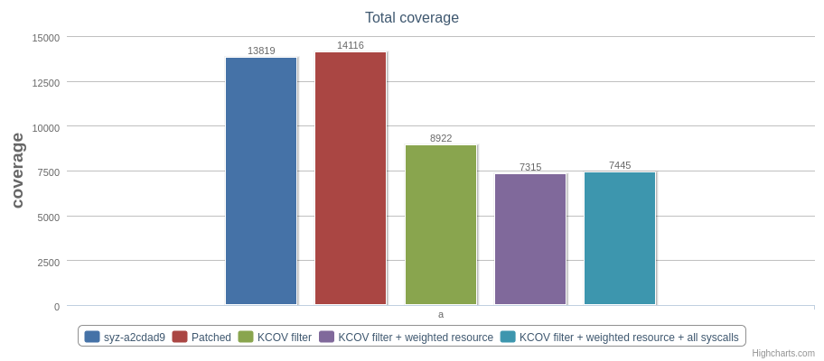
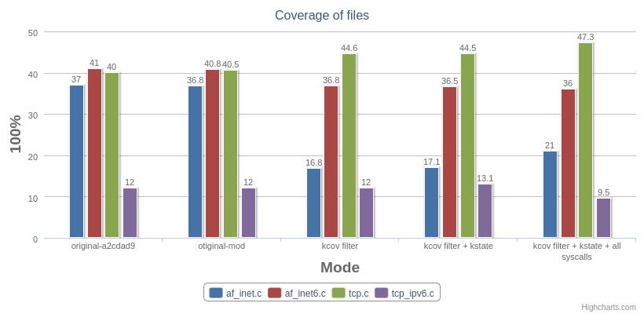
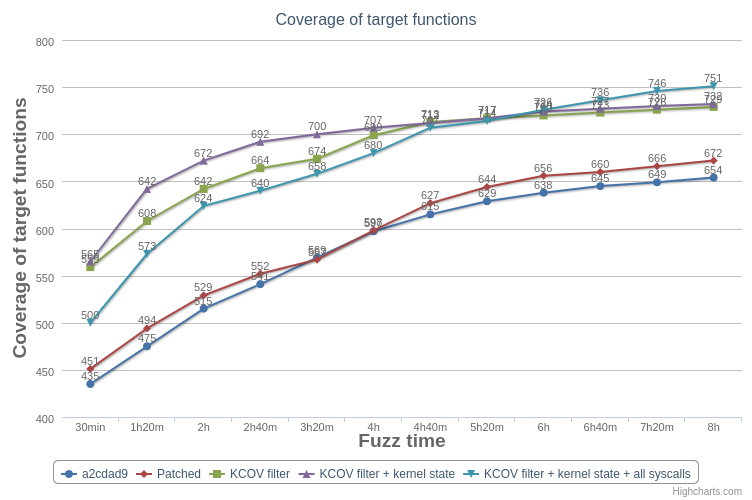

# Syzkaller

* Author/maintainer: Kaipeng Zeng
* Co-architect: Shawn C[ a.k.a "citypw"]

## 1. Summary & Background

Syzkaller is the state-of-the-art kernel fuzzer. It's effective because of its powerful syscalls descript and resource rules. Particularly, after resource centric was introducted to syzkaller, it can efficiently generate testcases with a complex context. It is the best choice if you want to fuzz your kernel.

While syzkaller can do targeted fuzz only by constraining syscalls, we can observe that it's no so efficient if you don't want to fuzz the entir kernel, for example, fuzz a subsystem or several functions. So, We improve syzkaller by introducing coverage filter and kernel state resource, to do targeted fuzz. Coverage filter avoids syzkaller pay too much attention to exploring uninteresting code. Kernel state resource evaluates if the testcase potentially helps to explore target. Both of them help syzkaller to fuzz the targeted code deeply and efficiently. Moreover, some syscalls which are not written for the target, can help to explore targeted code also. But if you don't do coverage filter, target can hardly benefit from them.

## 2. Feature of customized syzkaller

1. Kernel coverage filter and weighed PCs
2. Kernel state as a syzkaller resource
3. Extend syzkaller Web UI

These [patches](../syz_patch) base on syzkaller-a2cdad9.

## 2.1 Support cover filter and weighted PCs

The original syzkaller can only by constraining enable and disable syscalls to do a targeted fuzzing. Lots of code will be covered although we are not interested. And collect the testcase that trigger such edge will occupy a considerable proportion in the corpus while syzkaller generating and mutating new testcases base on corpus statistic. So, it will slow down the exploring and exploiting of the target. Also, in some cases, you may want to specify a code position gradient to tell fuzzer how to evolve testcases to touch the target position gradually. Or, you just want to fuzz some functions more frequently, maybe because of its complexity or importance. To make syzkaller a more targeted fuzzer, we implement a coverage filter and integrate it into syzkaller. It is not so rare in [userspace fuzzer](http://sharcs-project.eu/m/filer_public/48/8c/488c5fb7-9aad-4c87-ab9c-5ff251ebc73d/vuzzer_ndss17.pdf). And we try to implement it without patching kernel and can be flexibly configured in syzkaller. Even PCs weight can be change dynamically in fuzzing time.

More design detail and usage can be found [here](cover_filter.md). Except how to implement coverage filter efficiently, we also show you some examples of how to use LLVM analysis information to create weighted PCs table to tell customized syzkaller how to evolve testcases.

## 2.2 Syzkaller resource base on kernel state

Syzkaller already has resource centric machanism which help to generate more complex state resource for subsequent syscalls. Actually, lots of kernel condition constraints are not determined by the input of a single syscall. Most of the time, solve such condition constraints require a sequence of syscalls and their appropriate inputs. Particularly, after we introduce coverage filter, the state of resource is essential. We couldn't assume that any code outside of our target functions contributes nothing in exploring target functions. If a testcase can create a special resource which help solve the following condition constraint met by other syscalls, we call them kernel state. So, we should collect the testcases which can trigger special states to corpus so that they can be used in extracting resource for generating testcases.

General, in kernel, to pass over kernel functions efficiently, most of states are designed as a field of structure. For example, structure sock contains skc_state, skc_flags and so on. Base on this, we can instrument kernel where it stores or modifies some field of a structure( GetElementPointer operator in LLVM ir). We collect the information about which field of which structure is changed, the value of that field and the address of that operation. Before fuzz, we static analyze which field is used by your target functions more frequently, especially it's used in solving conditions. And tell fuzzer choose those testcases to extract resource more frequently if states of them may more frequently use by your target functions. Moreover, we also static analyze which value of fields are used in conditions.

More design detail and usage can be found [here](kstate_resource.md). We will show you how to collect kernel state triggered by testcase and how to prior choose testcase to extract resource. Furthermore, base on some static analysis tool, you can specify which and state which value is more meaningful to fuzzer. We show you a semi-manual way for this situation.

## 2.3 Extend syzkaller Web UI

#### Explicitly display the prior of prog and resource of a testcase

We attach "signal len", "cover weight", "state len" and "Resource weight" to "/corpus" interface. The original use signal length as prog prior. We recalculate the prog prior base on what it covered. And we priorly choose prog to extract resource base on which state it triggers while original syzkaller is totally random.

#### Coverage count of target functions

No matter if you use coverage filter or not, you can pass a PCs table to patch syzkaller, and access the "/kernfunc" interface to get the information about how much of a function was covered in this fuzzer.

#### Check the coverage filter configuration

Access "/bitmap" interface to get the colored source code to check if your PCs table is right.

#### Display which syscall trigger which kernel state

We attach kernel states triggered by prog to "/input" interface. You can conveniently trace syscalls behavior.

## 3. Practice and result

### A tcp-ipv6 fuzzing example

We choose member functions of tcpv6_prot and inet6_stream_ops as target functions to fuzz tcp-ipv6. This is inspired by [DDVerify](http://www.cprover.org/ddverify/) which is a symbolic execution tool for kernel driver, it chooses member functions of driver operation as the entry. However, because some of these member functions are only a wrap but not the implement. It contains less basic block information. We use a tool called [extend_func]() to extend the functions list if there is any function with less basic block. We run syzkaller with five modes:

1. Syzkaller at a2cdad9.
2. Patched syzkaller, base on a2cdad9, disable all features we introduce.
3. Patched syzkaller, base on a2cdad9, enable coverage filter.
4. Patched syzkaller, base on a2cdad9, enable coverage filter and weighted resource base on kernel state.
5. Patched syzkaller, enable coverage filter and weighted resource, enable all syscalls in syzkaller.

We use the same kernel and syscalls( except 5) for every mode. Every fuzzer run 6 times, and 8 hours( fuzzing time) per time.

And here is some information of the result.

| Crash name | a2cdad9 | Patched | KCOV filter | KCOV filter + Weighted resource | all syscalls |  
| ---- | ---- | ---- |  ---- |  ---- |  ---- |  
| BUG: soft lockip in io_uring_release | 0 | 0 | 0 | 0 | 5 |  
| WARNING in tcp_recvmsg | 0 | 0 | 4 | 1 | 0 |  
| WARNING in tcp_cleanup_rbuf | 0 | 0| 3 | 2 | 0 |  
| INFO: task hung in floppy_revailidate | 0 | 0 | 0 | 0 | 3 |  
| WARNING in __alloc_pages_nodemask | 0 | 0 | 0 | 0 | 1 |  
| divide error in __tcp_select_window | 0 | 0 | 0 | 0 | 1 |  
| WARNING in floppy_interrupt | 0 | 0 | 0 | 0 | 1|  

#### The performance influence of introducing these features

The second mode fuzzer is for analyzing the affect of our patch. Although we didn't use those features, prog prior is signal length, and all resources prior is 1, but we can actually observe the executor was slown down. It is because the patched syzkaller have to recalculate prog prior also. The total executed has a 15% reduction. From average 332/sec to 281/sec. But, it seems the coverage has another result. The coverage of patched syzkaller is slightly more than the original syzkaller. We still do not know the reason for it.

#### Coverage filter and weighted resource

In the target function coverage aspect, we can see there is a great improvement after coverage filtering introduced. Coverage of files also show a better result, noted that there are functions in af_inet.c and af_inet6.c was not used by tcp-ipv6. That means if you only want to fuzz subsystem or driver, it's a good choice to do coverage filter and weighted resource fuzz. You can get a better result in a shorter time.

#### Coverage filter, weighted resource and enable all syscalls.
This is the most interesting work in this document, while it makes no assumption that fuzzing a kernel subsystem should only use syscalls for this subsystem. But we take another assumption that lots of code except targeted function and state change contribute little in fuzzing target functions. The result shows us some tcp-ipv6 kernel functions can be covered by not-socket-relative syscalls. But, without coverage filtering, fuzzer may pay more attention to explore the potential coverage of these syscalls. And without kernel state collecting, fuzzer may miss it, because it contributes nothing. That means, in kernel subsystem or driver fuzzing, determinate what you want to fuzz, instead of which syscalls can be used to fuzz, could be effective also.

## 4. Conclusions

#### 4.1 Coverage filter and weighted

The syzkaller does targeted fuzz by constraining enable syscalls. It can efficiently explore the potential coverage of a single syscall, because mutate input to trigger new coverage in the whole call stack is easier than exploring paths base on complex states( Actually, one of the reasons that syzkaller is efficient is its resource mechanism). We can see fully exploring the deep corner trigger by a single syscall input to early, will slow down syzkaller exploring other branches. Because, there are a bunch of short testcases occupy a great proportion in the corpus while syzkaller will generate new testcase base on them. Instead of collecting every code edge, we limit the target into a serial of important functions. We preferentially explore those functions, keep a balance in exploring every potential corner. Our example reveals that explore such a kernel without any emphasis, it's not always efficient.

#### 4.2 Kernel state resource

Syzkaller resource mechanism is very important. Unlike most userspace fuzzer, the coverage always triggered by the sequence of syscalls and their input. The return of a syscalls is the input of other syscalls, syscalls may change resource state also. Our work indicated that collect and mutate frequently those resources that have more states changed could help to generate a testcase with a more complex context. Particularly, when a special state is used in target functions for solving condition constraints, that will bring us new coverage. While syzkaller know nothing about kernel state, it can only extract resource from testcases totaly randomly.

But, build a kernel with instrumentation is a little cumbrous if you change you fuzz target. The whole kernel instrumentation is OK, because we use kstate map to filter those states we don't need. But, it will greatly influence the performance of executor, observably it's impossible to do a bitmap filter like coverage filter. But, at the beginning, we used a [ebpf](kstat_demo) to collect kernel state to do a POC. You can manually write ebpf program to get states you need. It's configurable and more flexible but laborious and unstable and hardly scale up.

#### 4.3 Enable all syscalls

Our example shows us another way in fuzzing kernel: choose what to fuzz but not how to fuzz the target. While syzkaller need to pay a lot of effort to write syscalls and choose syscalls to fuzz. That is the only thing that can be controlled by user. If you want to fuzz a part of kernel, you should read the syscalls descript and look for which syscalls will cover this part, then pick them to the enable syscalls.

After introducing coverage filter and kernel state resource, base on syzkaller powerful syscalls descript, we can enable all syscalls to fuzz a target. Those syscalls can hardly cover target code will rarely or never appear in corpus. The only thing you should do is find out what you want to fuzz.

But, we still couldn't extricate from writing syscalls script. We try to run syzkaller without any syscalls with "$", the result is terrible. That means syscalls descript determine the potential coverage presently. We are exploring how to evolve syscalls automatically but not write syscalls script. We think it's possible to classify syscalls if any syscall can trigger a specific kernel state. It's one of the things we are interested in fuzzer.

## 5. Acknowledgments

* [Special thanks to Dmtry Vyukov and all contributors of syzkaller!](https://github.com/google/syzkaller)
* [Thanks to LLVM-project!](https://github.com/llvm/llvm-project)
